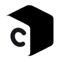
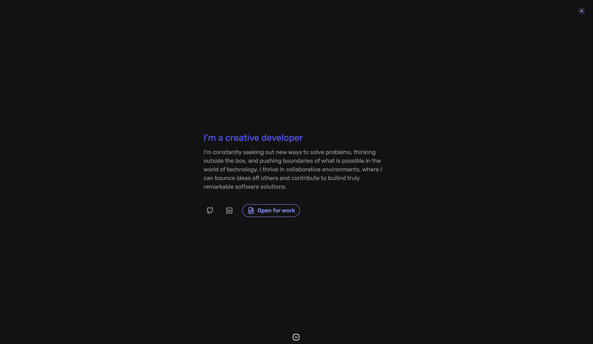

<p align="center">
  
</p>

<p align="center">
My personal universe
</p>

<p align="center">
  
</p>

## Table of Contents

- [Table of Contents](#table-of-contents)
- [👀 Overview](#-overview)
- [🚀 Quickstart](#-quickstart)
  - [Setup](#setup)
  - [Development Server](#development-server)
- [Contact](#contact)
- [License](#license)
- [Hire me](#hire-me)
- [Credits](#credits)


## 👀 Overview

This is my personal [website](https://rootasjey.dev) and portfolio made with [Nuxt](https://nuxt.com) and [Firebase](https://firebase.google.com/). <br />
It has my resume, runnable projects, some blog posts. It's responsive too.

If you wish to clone and/or run this project, you'll need a Firebase account with similar settings as mine.

## 🚀 Quickstart

Follow these steps to run the project on your local environment.

**Prerequisites**:
Make sure you have Git & Flutter installed on your computer. You'll also need a Firebase account and configuration files.

* [Git](https://git-scm.com)
* [Bun](https://bun.sh)
* Create a [Firebase project](https://firebase.com) to obtain your own API keys

Run the project:
* Clone the project locally with `git clone https://github.com/rootasjey/rootasjey.dev.git`
* `cd rootasjey.dev`


### Setup

Make sure to install the dependencies:

```bash
# bun
bun install
```

### Development Server

Start the development server on `http://localhost:3000`:

```bash
# bun
bun run dev
```

Check out the [deployment documentation](https://nuxt.com/docs/getting-started/deployment) for more information.

## Contact

You can contact me through the website or by opening a pull request in this repository.

## License

MIT License.

Feel free to clone this project for your own benefits as long as you generate your own content.

## Hire me

I live in France and I currently take freelance work.

## Credits

* [Nuxt UI docs](https://ui.nuxt.com)
* [Nuxt docs](https://nuxt.com/docs/getting-started/introduction)
* [Light Switch Turn Off Sound](https://freesound.org/people/ChrisTutorials/sounds/440499/) by [ChrisTutorials](https://freesound.org/people/ChrisTutorials/)
* [Switch Light 02.wav](https://freesound.org/people/tbrook/sounds/348221/) by [tbrook](https://freesound.org/people/tbrook/)
