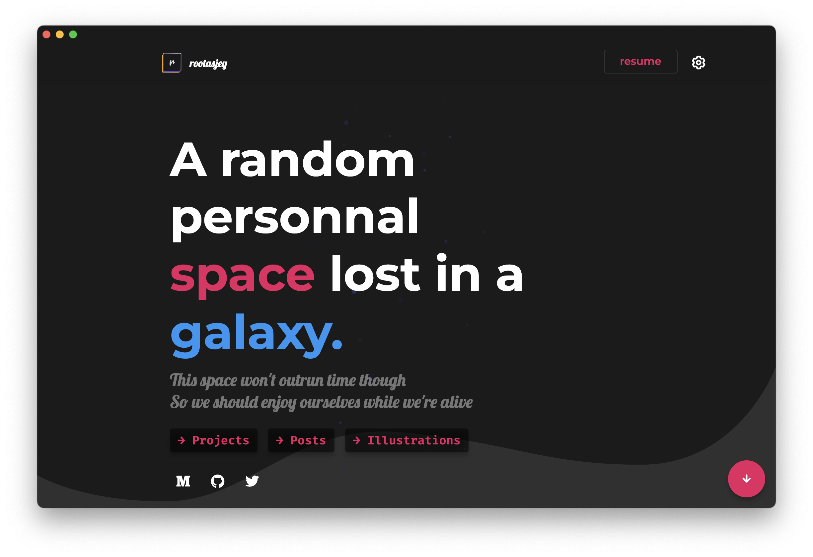

  

My personal universe

  

## Table of Contents

- [Table of Contents](#table-of-contents)
- [👀 Overview](#-overview)
- [🚀 Quickstart](#-quickstart)
- [✨ Features](#-features)
  - [**Landing Page**](#landing-page)
  - [**Blog**](#blog)
  - [**Projects**](#projects)
  - [**Artworks**](#artworks)
- [Contact](#contact)
- [License](#license)
- [Hire me](#hire-me)

## 👀 Overview

This is my personal [website](https://rootasjey.dev) and portfolio made with [Flutter](https://flutter.dev) and [Firebase](https://firebase.google.com/).  
It has my resume, runnable projects, some blog posts and illustrations (I like drawing). It's responsive too.

If you wish to clone and/or run this project, you'll need a Firebase account with similar settings as mine. I'm going to write a post to explain what services you need (basically Firestore, Functions and Storage).

## 🚀 Quickstart

Follow these steps to run the project on your local environment.

**Prerequisites**:
Make sure you have Git & Flutter installed on your computer. You'll also need a Firebase account and configuration files.

* [Flutter](https://flutter.dev)
* [Git](https://git-scm.com)
* Create a [Firebase project](https://firebase.com) to obtain your own API keys

Run the project:
* Clone the project locally with `git clone https://github.com/rootasjey/rootasjey.dev.git`
* `cd rootasjey.dev`

Use [`flutterfire`](https://firebase.google.com/docs/flutter/setup?platform=ios#available-plugins) to signin and configure the project. You should then have new files in your project depending on which platform you activate:

* `macos/firebase_app_id_file.json`
* `lib/firebase_options.dart`

Then run:
* `flutter pub get`
* `flutter run -d chrome` (or `flutter run -d macos`)

## ✨ Features

This personal virtual space has several purposes.

### **Landing Page**

The landing page welcomes the user with a hero text, GitHub activity and a quick presentation of myself.

### **Blog**

There's a blog section with articles stored in Firestore and Firebase Storage. It uses basic document format and rendering in markdown.

I mostly write about Flutter and Firebase these days, but I may also talk about web and game development.

Posts will be published on [my blog](https://rootasjey.dev/posts), [Hashnode](https://rootasjey.hashnode.dev/) and [Medium](https://medium.com/@rootasjey).

### **Projects**

The projects sections showcases runnable projects. This is my portfolio to demonstrate my skills and capabilities.

### **Artworks**

There, you'll find my drawings. I'm building a platform where to post them.

## Contact

You can contact me through the website or by opening a pull request in this repository.

## License

MIT License.

Feel free to clone this project for your own benefits as long as you generate your own content.

## Hire me

I live in France and I currently take freelance work.
