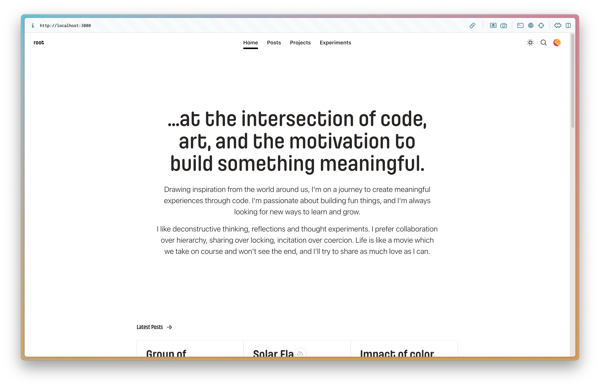

# rootasjey.dev



Welcome to my digital garden! 🌱

This is my personal website where I showcase my work, thoughts, and experiments. It serves as a digital garden where I cultivate ideas and share my journey at the intersection of code and creativity.

## What You'll Find Here

* Projects: A collection of finished coding projects I've worked on, sometimes spanning years
* Posts: Thoughts, insights, and contemplations - a garden of ideas in constant motion
* Experiments: A playground for testing new ideas and breaking conventional boundaries


## Tech Stack

This website is built with:

* [Nuxt 3](https://nuxt.com/) - Vue-based framework for building modern web applications
* [UnaUI](https://unaui.com/) - UI component library
* [NuxtHub](https://hub.nuxt.com/) - Serverless backend powered by Cloudflare

## Development

```bash
# Install dependencies
npm install

# Start the development server on http://localhost:3000:
npm run dev

# Build the application for production:
npm run build

# Locally preview production build:
npm run preview
```

## License

This project is licensed under the MIT License - see the LICENSE file for details.

## Contact

Feel free to reach out to me through the contact information available on the website.

© 2023-2024 rootasjey. All rights reserved.