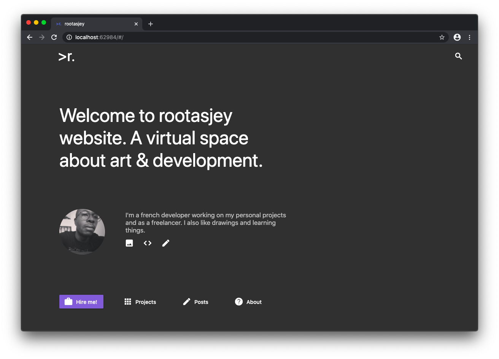

# rootasjey

My personal website.

## Table of Contents

* [Presentation](#presentation)
* [Blog](#blog)
* [Projects](#projects)
* [Artworks](#artworks)
* [Contact](#contact)
* [Development](#development)
* [Hire me](#hire-me)

## Presentation

Welcome to my personal virtual space.

This website, built with [Flutter](https://flutter.dev) and [Firebase](https://firebase.google.com/), showcases my projects and my experience in programming and game development.

## Blog

I mostly write about Flutter and Firebase these days, but I'll also talk about Fitbit, Electron and Phaser. I share short stories about a programming experience and full tutorials from start to finish.

These stories will be published on my blog, Hashnode and [Medium](https://medium.com/@rootasjey).

## Projects

This section presents my best experiments with code.

## Artworks

There, you'll find my drawings. I'm building a platform where to post them.

## Contact

You can contact me through the website or by opening a pull request in this repository.

## Development

This project demonstrates how to create a personal website with Flutter & Firebase and can be used as a template for your own website. As long as you generate your own content.

## Hire me

I live in France and I currently take freelance work.
